# Support Table Data Architecture

This document describes the architecture and design patterns of the `support_table_data` gem, which provides a robust solution for managing static support tables (lookup tables) in ActiveRecord applications.

## Overview

The SupportTableData gem solves the common problem of managing small, canonical datasets that exist at the intersection of data and code. These support tables contain a limited number of rows with values that are often referenced in application logic, making them critical for proper application function.

## Core Components

### Main Components Overview

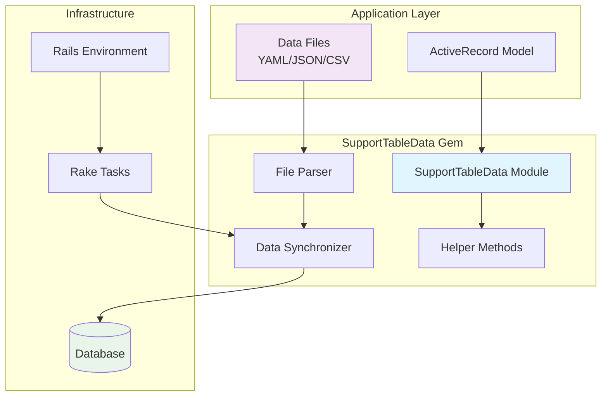

## Data Flow Architecture

The gem follows a clear data flow pattern from static files to database records:

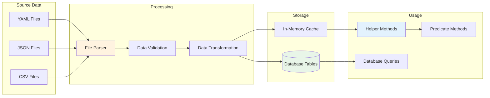

## Class Structure

### Core Module Design

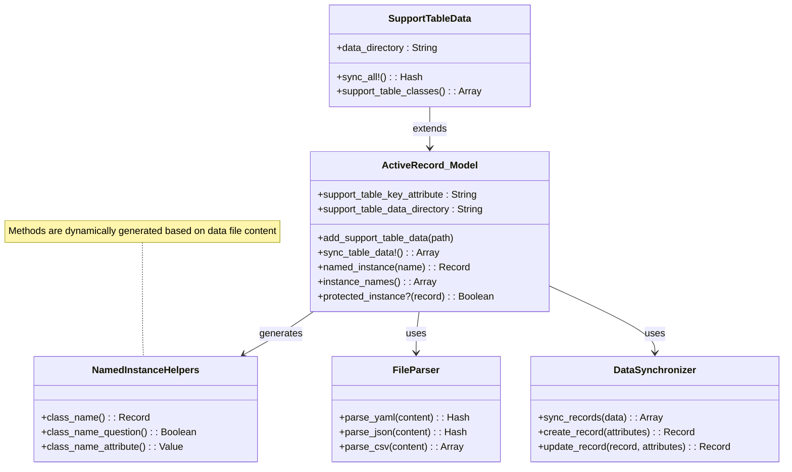

## Named Instance System

The gem's most powerful feature is its named instance system, which generates helper methods from data files:

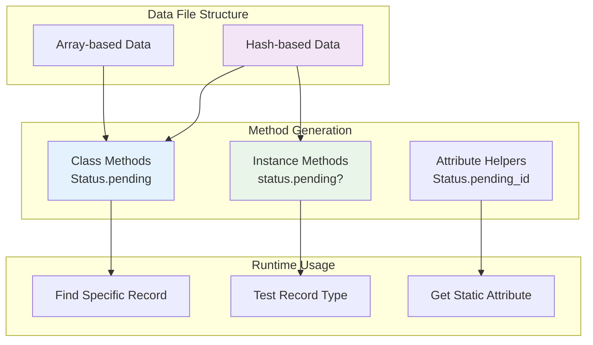

## Data Synchronization Process

The synchronization process ensures database consistency with data files:

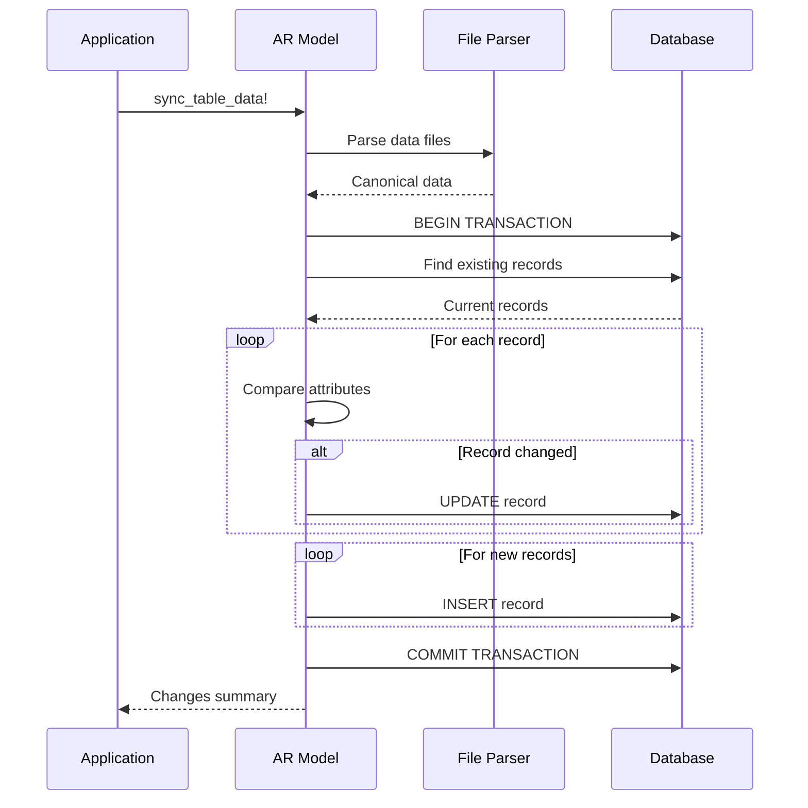

## File Format Support

The gem supports multiple data file formats with a unified interface:

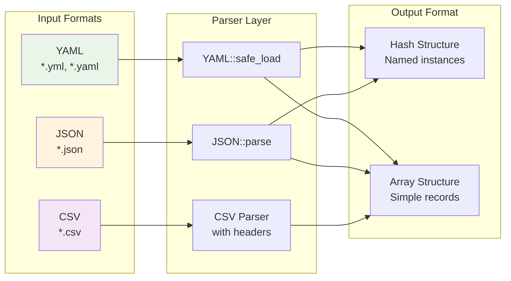

## Dependency Resolution

The gem automatically resolves dependencies between support table models:

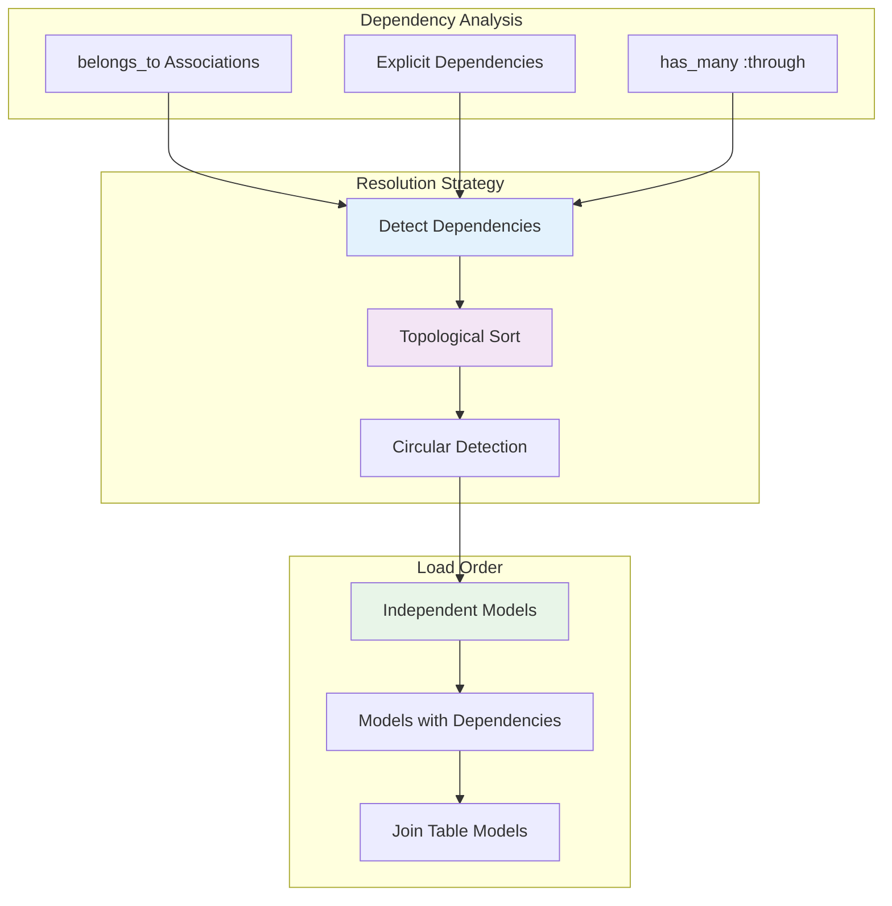

## Rails Integration

The gem integrates seamlessly with Rails applications:

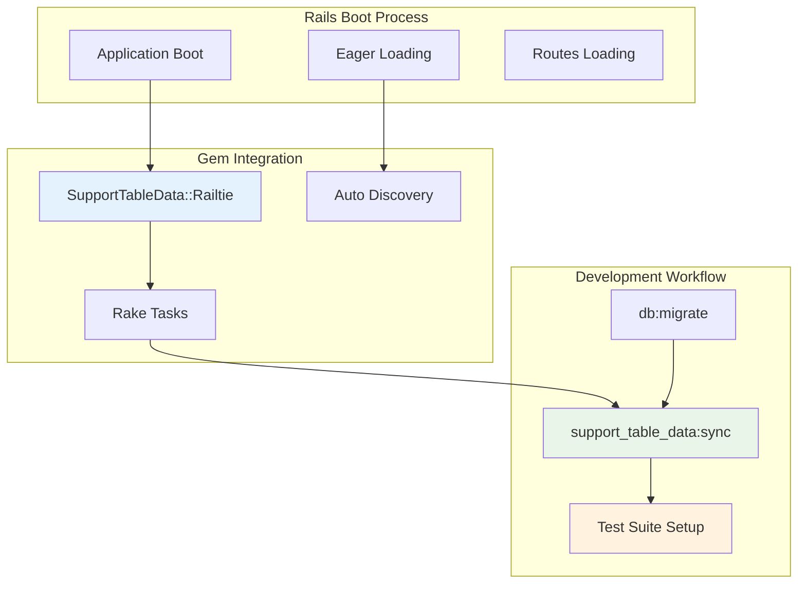

## Error Handling and Validation

The gem includes comprehensive error handling:

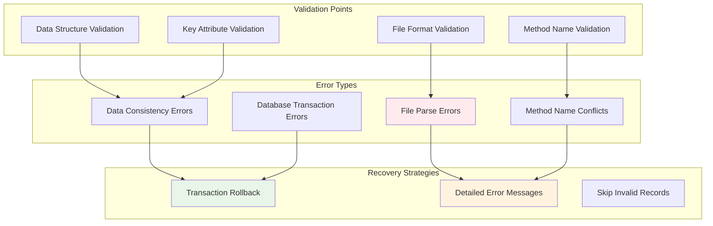

## Performance Considerations

The gem is designed for optimal performance with small datasets:

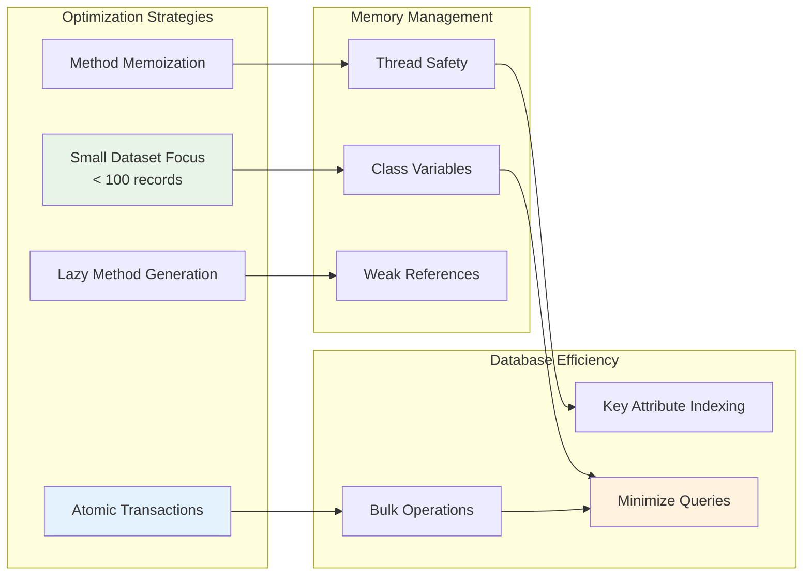

## Extension Points

The gem provides several extension points for customization:

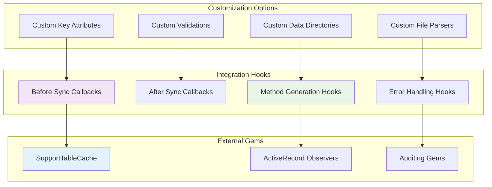

## Deployment Strategy

The gem follows a deployment-friendly pattern:

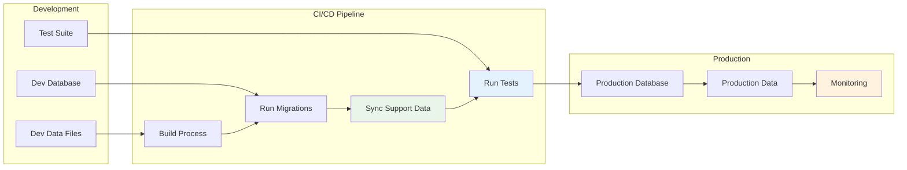

## Best Practices

### Model Organization

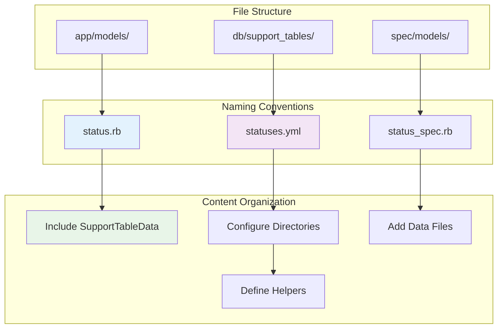

## Summary

The SupportTableData gem provides a comprehensive solution for managing static support tables through:

1. **Declarative Configuration**: Define support data in version-controlled files
2. **Automatic Synchronization**: Keep database records in sync with data files
3. **Generated Helper Methods**: Clean, readable code for accessing specific records
4. **Dependency Management**: Automatic resolution of inter-table dependencies
5. **Rails Integration**: Seamless integration with Rails applications and deployment workflows
6. **Type Safety**: Compile-time method generation with runtime validation
7. **Performance**: Optimized for small datasets with minimal overhead

The architecture promotes maintainable code by keeping support data close to the application logic while ensuring data consistency across environments.

<function_calls>
<invoke name="get-syntax-docs-mermaid">
<parameter name="file">flowchart.md